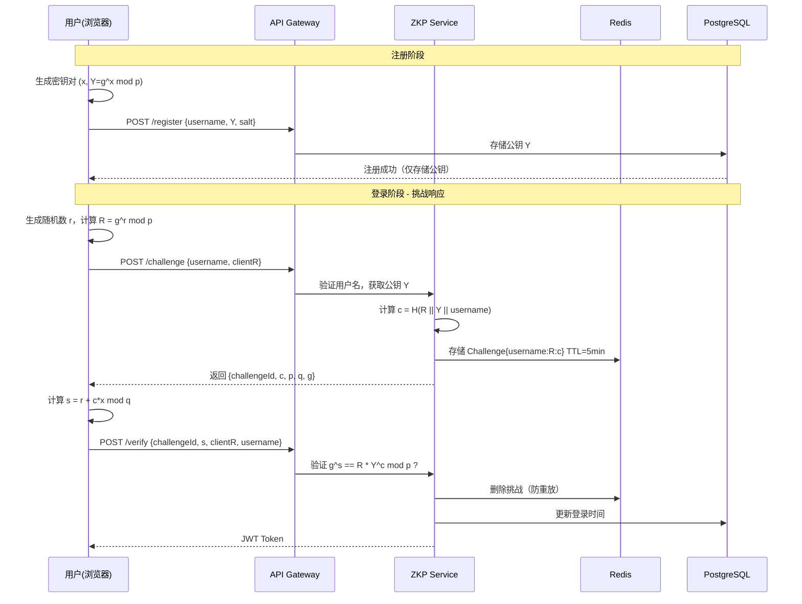
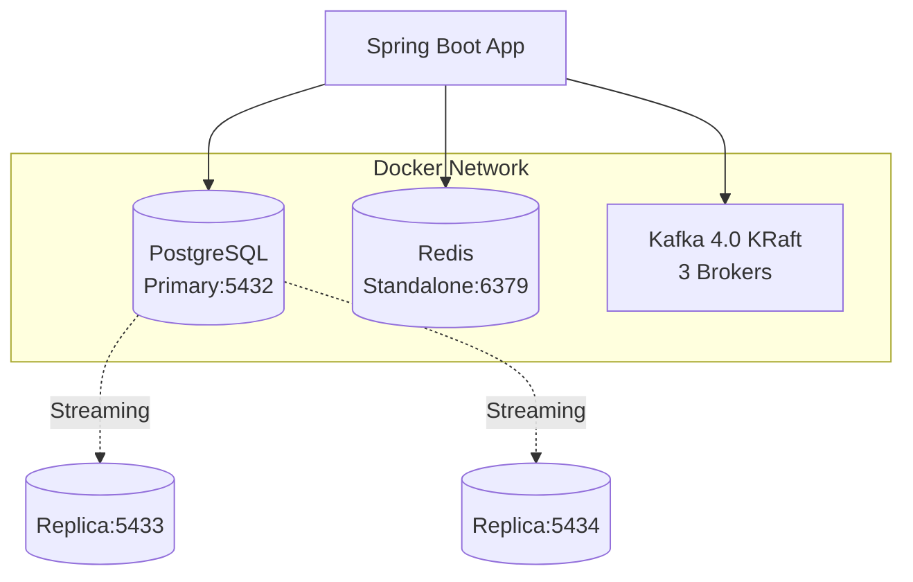

# 🔐 ZKP Auth System | 零知识证明身份验证系统

[](https://spring.io/projects/spring-boot)
[](https://openjdk.org/projects/jdk/17/)
[](https://en.wikipedia.org/wiki/Schnorr_signature)
[](LICENSE)

> **零知识证明（Zero-Knowledge Proof）** 登录系统：用户证明拥有私钥而无需传输私钥，服务端仅存储公钥，彻底杜绝拖库风险。

---

## 🎯 核心特性

- **零知识认证**：基于 Schnorr 协议的交互式证明，服务器**永不接触用户私钥**
- **高可用架构**：PostgreSQL 主从复制 + Redis 缓存 + Kafka 审计日志
- **响应式设计**：Spring WebFlux 非阻塞 IO，支持高并发登录请求
- **防重放攻击**：Redis 存储一次性挑战（Challenge），5分钟 TTL 自动过期
- **审计追踪**：Kafka 异步记录所有登录事件（成功/失败/注册）

---

## 🏗️ 系统架构

### 认证流程（Schnorr Protocol）



### 基础设施拓扑



---

## 🛠️ 技术栈

| 组件 | 版本 | 用途 |
|------|------|------|
| **Spring Boot** | 3.5.10 | 响应式 Web 框架（WebFlux） |
| **Java** | 17 | 运行时 |
| **Bouncy Castle** | 1.83 | 大数运算与密码学原语 |
| **PostgreSQL** | 16 | 主从复制存储用户公钥 |
| **Redis** | 8.4 | 存储挑战值与防重放 |
| **Kafka** | 4.0.0 | KRaft 模式，审计日志 |
| **Protocol** | Schnorr | 零知识证明协议 |

---

## 🚀 快速开始

### 环境要求

- Docker Engine 24.0+
- Docker Compose 2.20+
- Java 17（本地运行时需要）
- Maven 3.9+
- Node.js 16+（压力测试需要）

### 1. 克隆项目并构建

```bash
# 1. 进入项目目录
cd zkp_rkp

# 2. 构建应用
mvn clean package -DskipTests

# 3. 启动基础设施
docker-compose -f docker-compose.infra.yml up -d

# 4. 等待服务启动（约30秒）
docker-compose -f docker-compose.infra.yml ps
```

### 2. 启动应用

```bash
# 方式1: 直接运行
java -jar target/zkp_rkp-0.0.1-SNAPSHOT.jar

# 方式2: Docker运行
docker-compose up --build
```

### 3. 运行压力测试

```bash
cd pressure_test
npm install

# 运行完整流程压测
npm run test:full

# 或运行修复验证测试
node verify_fix.js
```

---

## 📡 API 接口

### 1. 用户注册

```bash
POST /api/v1/auth/register
Content-Type: application/json

{
  "username": "alice",
  "publicKeyY": "7c3c4f6d4e410e14...",  // 公钥 Y = g^x mod p，十六进制
  "salt": "a1b2c3d4..."                   // 随机盐值
}
```

**响应**:
```json
{
  "username": "alice",
  "message": "User registered successfully"
}
```

### 2. 获取挑战

```bash
POST /api/v1/auth/challenge
Content-Type: application/json

{
  "username": "alice",
  "clientR": "17de3a0a90d673b3..."  // 客户端承诺 R = g^r mod p
}
```

**响应**:
```json
{
  "challengeId": "550e8400-e29b-41d4-a716-446655440000",
  "c": "e7a8392cc84a7180...",  // 挑战值 c = H(R || Y || username)
  "p": "ffffffffffffffff...",  // 1536-bit 素数
  "q": "7fffffffffffffff...",  // (p-1)/2
  "g": "2"
}
```

### 3. 验证证明

```bash
POST /api/v1/auth/verify
Content-Type: application/json

{
  "challengeId": "550e8400-e29b-41d4-a716-446655440000",
  "s": "52fab387eb8fbd38...",     // 证明 s = r + c*x mod q
  "clientR": "17de3a0a90d673b3...", // 承诺 R
  "username": "alice"
}
```

**成功响应**:
```json
{
  "token": "eyJhbGciOiJIUzUxMiJ9...",
  "type": "Bearer",
  "expiresIn": 86400
}
```

---

## 🔐 密码学实现详解

### Schnorr 群参数（RFC 3526 1536-bit MODP Group）

| 参数 | 值 | 说明 |
|------|-----|------|
| **p** | 1536-bit safe prime | 模运算基数 |
| **q** | (p-1)/2 | 子群阶数 |
| **g** | 2 | 生成元 |

**重要更新**: 系统已从 256-bit 升级到 **1536-bit** 参数，提供更强的安全性。

### Schnorr 协议在本项目中的映射

| 数学符号 | 代码变量 | 说明 | 存储位置 |
|---------|---------|------|---------|
| **p** | `SchnorrGroup.p` | 1536-bit 大素数 | `ZkpCryptoConfig` |
| **q** | `SchnorrGroup.q` | (p-1)/2 | `ZkpCryptoConfig` |
| **g** | `SchnorrGroup.g` | 生成元 | `ZkpCryptoConfig` |
| **x** | `privateKey` | 用户私钥 | **仅客户端保管** |
| **Y = g^x** | `publicKeyY` | 用户公钥 | PostgreSQL |
| **r** | `randomR` | 客户端随机数 | 仅内存 |
| **R = g^r** | `clientR` | 承诺值 | 传输给服务器 |
| **c** | `challenge` | H(R \|\| Y \|\| username) | Redis (TTL=5min) |
| **s** | `proof.s` | r + c*x mod q | 客户端计算并提交 |

### 验证方程（服务端检查）

$$
g^s \stackrel{?}{=} R \cdot Y^c \pmod{p}
$$

**正确性证明**:

- 左式：$g^s = g^{r+cx} = g^r \cdot g^{cx} = R \cdot (g^x)^c = R \cdot Y^c$
- 右式：$R \cdot Y^c$
- 若相等，证明者确实知道 $x = \log_g Y$

---

## 📁 项目结构

```
zkp_rkp/
├── src/main/java/com/tmd/zkp_rkp/
│   ├── config/
│   │   ├── ZkpCryptoConfig.java          # Schnorr 群参数配置
│   │   ├── RedisConfig.java              # Redis 连接配置
│   │   └── KafkaProducerConfig.java      # Kafka 生产者配置
│   ├── controller/
│   │   └── AuthController.java           # REST API 端点
│   ├── dto/
│   │   └── AuthDTOs.java                 # 请求/响应 DTO
│   ├── entity/
│   │   └── UserCredentials.java          # JPA 实体
│   ├── repository/
│   │   └── UserCredentialsRepository.java # 数据库访问
│   ├── service/
│   │   ├── AuthService.java              # 业务编排
│   │   ├── crypto/
│   │   │   └── ZkpService.java           # 核心：Schnorr 验证
│   │   ├── kafka/
│   │   │   └── AuthEventPublisher.java   # 审计事件发布
│   │   └── util/
│   │       └── JwtUtil.java              # JWT 工具
│   ├── exception/
│   │   └── GlobalExceptionHandler.java   # 全局异常处理
│   └── ZkpAuthApplication.java
│
├── pressure_test/                        # 压力测试套件
│   ├── README.md                         # 压测文档
│   ├── package.json                      # Node.js 依赖
│   ├── zkp_crypto_fixed.js               # 客户端加密库
│   ├── full_flow_test.js                 # 完整流程压测
│   ├── register_test.js                  # 注册压测
│   ├── login_test.js                     # 登录压测
│   └── verify_fix.js                     # 修复验证测试
│
├── docker-compose.yml                    # 应用编排
├── docker-compose.infra.yml              # 基础设施编排
├── .env.example                          # 环境变量模板
└── README.md                             # 本文档
```

---

## 🛡️ 安全特性

1. **零知识性**: 验证过程不泄露私钥 $x$ 的任何信息
2. **抗重放**: 每个挑战仅可使用一次，验证后立即从 Redis 删除
3. **时效限制**: 挑战 5 分钟未使用自动过期
4. **防枚举**: 即使用户名不存在，接口也会正常返回假挑战（时间恒定）
5. **审计追踪**: 所有登录尝试通过 Kafka 异步记录
6. **传输安全**: 建议配合 HTTPS/TLS，防止中间人篡改

---

## ⚙️ 配置说明

### 关键环境变量

```env
# PostgreSQL
SPRING_DATASOURCE_URL=jdbc:postgresql://localhost:5432/zkp_auth
SPRING_DATASOURCE_USERNAME=zkp_user
SPRING_DATASOURCE_PASSWORD=zkp_password

# Redis
SPRING_REDIS_HOST=localhost
SPRING_REDIS_PORT=6379

# Kafka
SPRING_KAFKA_BOOTSTRAP_SERVERS=localhost:9092,localhost:9093,localhost:9094

# JWT
JWT_SECRET=your-secret-key-here
JWT_EXPIRATION=86400
```

### 调整挑战有效期

```yaml
# application.yaml
zkp:
  challenge:
    ttl-seconds: 300      # 挑战过期时间（5分钟）
    max-concurrent: 3     # 单用户并发挑战数限制
```

---

## 💻 客户端集成示例

### JavaScript 客户端 SDK

```javascript
const { 
  generatePrivateKey, 
  generatePublicKey,
  generateRandomR,
  computeCommitmentR,
  computeProofS,
  generateSalt 
} = require('./zkp_crypto_fixed');

// 1. 注册
const x = generatePrivateKey();
const Y = generatePublicKey(x);
const salt = generateSalt();

await axios.post('/api/v1/auth/register', {
  username: 'alice',
  publicKeyY: Y.toString(16),
  salt
});

// 2. 登录 - 获取挑战
const r = generateRandomR();
const R = computeCommitmentR(r);

const challengeRes = await axios.post('/api/v1/auth/challenge', {
  username: 'alice',
  clientR: R.toString(16)
});

const { challengeId, c } = challengeRes.data;

// 3. 计算证明
const cBigInt = new BigInteger(c, 16);
const s = computeProofS(r, cBigInt, x);

// 4. 验证
const verifyRes = await axios.post('/api/v1/auth/verify', {
  challengeId,
  s: s.toString(16),
  clientR: R.toString(16),
  username: 'alice'
});

const jwtToken = verifyRes.data.token;
```

---

## 📊 性能指标

| 指标 | 数值 | 说明 |
|------|------|------|
| **登录延迟** | ~200-500ms | 主要消耗在 1536-bit 大数模幂运算 |
| **吞吐量** | ~100-200 QPS | 单机（4核8G），受限于加密运算 |
| **挑战存储** | ~300 bytes/Challenge | Redis 内存占用 |
| **密码学强度** | ~80-bit security | 基于 1536-bit 离散对数问题 |

**注意**: 1536-bit 运算比 256-bit 慢约 10-15 倍，这是安全性与性能的 trade-off。

---

## 🐛 常见问题

**Q: 为什么验证总是返回 401？**

A: 检查以下几点：
1. 确保使用 `zkp_crypto_fixed.js` 而非旧的 `zkp_crypto.js`
2. 检查服务器日志中的 `ZKP Verification Debug` 信息
3. 确认 `leftSide (g^s)` 和 `rightSide (R*Y^c)` 是否相等
4. 验证 Q 值是否正确计算为 (P-1)/2

**Q: 注册超时怎么办？**

A: 1536-bit 模幂运算较慢，建议：
1. 增加超时时间到 120 秒
2. 减少并发用户数
3. 优化服务器线程池配置

**Q: 为什么私钥不能找回？**

A: 零知识证明的本质是服务端不存储任何可推导私钥的信息。如果用户丢失私钥，只能重新注册生成新密钥对。

---

## 📝 更新日志

### 2025-01-29
- **修复**: 将 Q 值从 256-bit 修正为 1536-bit (P-1)/2
- **修复**: 服务器现在存储挑战值 c 而非重新计算
- **优化**: 添加详细的 ZKP 验证调试日志
- **新增**: 完整的压力测试套件

---

## 📚 参考资料

- [RFC 3526 - More Modular Exponential (MODP) Diffie-Hellman groups](https://tools.ietf.org/html/rfc3526)
- [Schnorr Signature - Wikipedia](https://en.wikipedia.org/wiki/Schnorr_signature)
- [Zero-Knowledge Proof - Wikipedia](https://en.wikipedia.org/wiki/Zero-knowledge_proof)
- [Spring WebFlux Documentation](https://docs.spring.io/spring-framework/reference/web/webflux.html)

---

**安全提示**: 本项目为本人兴趣用途，生产环境使用需通过第三方安全审计，并建议增加双因素认证（2FA）作为补充。
