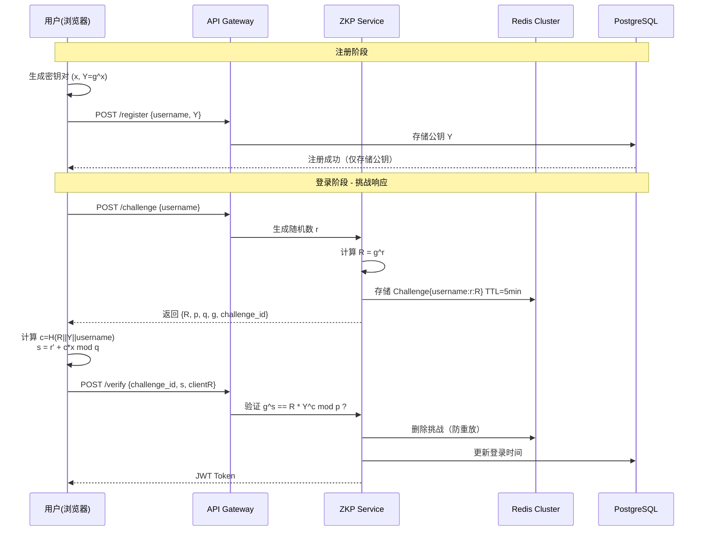
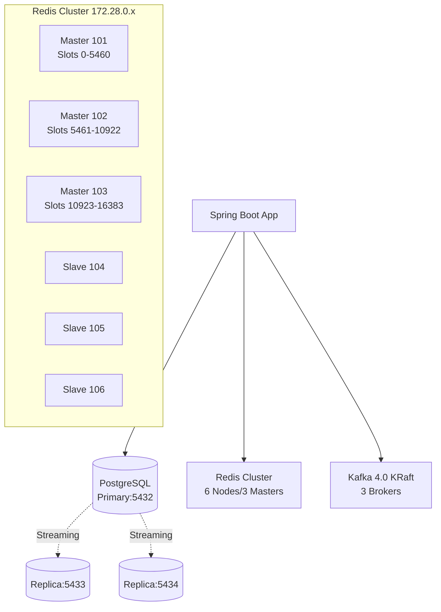

# 🔐 ZKP Auth System | 零知识证明身份验证系统

[](https://spring.io/projects/spring-boot)
[](https://openjdk.org/projects/jdk/17/)
[](https://en.wikipedia.org/wiki/Schnorr_signature)
[](LICENSE)

> **零知识证明（Zero-Knowledge Proof）** 登录系统：用户证明拥有私钥而无需传输私钥，服务端仅存储公钥，彻底杜绝拖库风险。

---

## 🎯 核心特性

- **零知识认证**：基于 Schnorr 协议的交互式证明，服务器**永不接触用户私钥**
- **高可用架构**：PostgreSQL 一主二从 + Redis 6节点 Cluster + Kafka 4.0 KRaft 三节点集群
- **响应式设计**：Spring WebFlux 非阻塞 IO，支持高并发登录请求
- **防重放攻击**：Redis 存储一次性挑战（Challenge），5分钟 TTL 自动过期
- **审计追踪**：Kafka 异步记录所有登录事件（成功/失败/注册）

---

## 🏗️ 系统架构

### 认证流程（Schnorr Protocol）



### 基础设施拓扑



---

## 🛠️ 技术栈

| 组件 | 版本 | 用途 |
|------|------|------|
| **Spring Boot** | 3.5.10 | 响应式 Web 框架（WebFlux） |
| **Java** | 17 | 运行时 |
| **Bouncy Castle** | 1.83 | 大数运算与密码学原语 |
| **PostgreSQL** | 16 | 主从复制（1主2从）存储用户公钥 |
| **Redis** | 8.4 | Cluster 模式存储挑战值与防重放 |
| **Kafka** | 4.0.0 | KRaft 模式，审计日志 |
| **Protocol** | Schnorr | 零知识证明协议 |

---

## 🚀 快速开始

### 环境要求

- Docker Engine 24.0+
- Docker Compose 2.20+
- Java 17（本地运行时需要）
- Maven 3.9+

### 1. 启动基础设施

```bash
# 克隆项目后，确保 .env 文件存在
cp .env.example .env

# 启动所有服务（PostgreSQL主从 + Redis集群 + Kafka集群）
docker-compose up -d

# 等待 30 秒让集群初始化
docker logs redis-bootstrap  # 应显示 "[OK] All 16384 slots covered"
docker logs kafka-1          # 应显示 "[KafkaServer id=1] started"
```

### 2. 启动应用

```bash
# Springboot和中间件分别运行
./mvnw spring-boot:run -Dspring-boot.run.profiles=local
docker-compose up --build
```

### 3. 测试验证

```bash
# 1. 注册（客户端生成密钥对，仅传输公钥）
curl -X POST http://localhost:8080/api/v1/auth/register \
  -H "Content-Type: application/json" \
  -d '{
    "username": "alice",
    "publicKeyY": "a1b2c3...",  # 十六进制公钥 Y = g^x mod p
    "salt": "random_salt_123"
  }'

# 2. 获取挑战值
curl -X POST http://localhost:8080/api/v1/auth/challenge \
  -H "Content-Type: application/json" \
  -d '{"username": "alice"}'
# 返回: {"challengeId":"uuid","R":"...","p":"...","q":"...","g":"..."}

# 3. 计算并提交证明（客户端用私钥计算 s = r + c*x）
curl -X POST http://localhost:8080/api/v1/auth/verify \
  -H "Content-Type: application/json" \
  -d '{
    "challengeId": "uuid-from-step-2",
    "s": "deadbeef...",      # 证明值 s
    "clientR": "cafe1234..." # 承诺值 R
  }'
# 返回: {"token":"jwt-token","type":"Bearer","expiresIn":86400}
```

---

## 📁 项目结构

```
src/main/java/com/tmd/zkp_rkp/
├── config/
│   ├── ZkpCryptoConfig.java          # Schnorr 群参数配置 (p, q, g)
│   ├── RedisConfig.java              # Redis Cluster 序列化配置
│   └── SecurityConfig.java           # CORS 与安全头配置
├── controller/
│   └── AuthController.java           # REST API 端点 (register/challenge/verify)
├── dto/
│   └── AuthDTOs.java                 # Record: Request/Response DTOs
├── entity/
│   └── UserCredentials.java          # JPA 实体 (仅存储公钥 Y, salt)
├── repository/
│   └── UserCredentialsRepository.java # Spring Data JPA
├── service/
│   ├── AuthService.java              # 业务逻辑编排
│   ├── crypto/
│   │   └── ZkpService.java           # 核心：Schnorr 挑战生成与验证
│   └── kafka/
│       └── AuthEventPublisher.java   # 审计事件发布
└── ZkpAuthApplication.java

docker-compose.yml                    # 基础设施编排 (PG主从+Redis集群+Kafka)
application.yaml                      # Spring 配置 (连接池、集群节点地址)
```

---

## 🔐 密码学实现详解

### Schnorr 协议在本项目中的映射

| 数学符号 | 代码变量 | 说明 | 存储位置 |
|---------|---------|------|---------|
| **p** | `SchnorrGroup.p` | 2048-bit 大素数 | 硬编码在 `ZkpCryptoConfig` |
| **q** | `SchnorrGroup.q` | p-1 的素因子 (256-bit) | 硬编码在 `ZkpCryptoConfig` |
| **g** | `SchnorrGroup.g` | 生成元 (通常为 2) | 硬编码在 `ZkpCryptoConfig` |
| **x** | `privateKey` | 用户私钥 | **仅客户端保管** |
| **Y = g^x** | `publicKeyY` | 用户公钥 | PostgreSQL (user_credentials 表) |
| **r** | `randomR` | 服务端随机数 | Redis (TTL=5min，一次性) |
| **R = g^r** | `challenge.R` | 承诺值 | 传输给客户端 |
| **c** | `hashChallenge` | H(R \|\| Y \|\| username) | Fiat-Shamir 启发式 |
| **s** | `proof.s` | r + c*x mod q | 客户端计算并提交 |

### 验证方程（服务端检查）

$$
g^s \stackrel{?}{=} R \cdot Y^c \pmod{p}
$$

**正确性证明**：

- 左式：$g^s = g^{r+cx} = g^r \cdot g^{cx} = R \cdot (g^x)^c = R \cdot Y^c$
- 右式：$R \cdot Y^c$
- 若相等，证明者确实知道 $x = \log_g Y$

---

## 🛡️ 安全特性

1. **零知识性**：验证过程不泄露私钥 $x$ 的任何信息
2. **抗重放**：每个挑战（Challenge）仅可使用一次，验证后立即从 Redis 删除
3. **时效限制**：挑战 5 分钟未使用自动过期
4. **防枚举**：即使用户名不存在，接口也会正常返回假挑战（时间恒定）
5. **审计追踪**：所有登录尝试（成功/失败）通过 Kafka 异步记录，可用于风控分析
6. **传输安全**：建议配合 HTTPS/TLS，防止中间人篡改 $R$ 或 $s$

---

## ⚙️ 配置说明

### 关键环境变量

```env
# PostgreSQL 主从 (docker-compose 内部网络)
SPRING_DATASOURCE_URL=jdbc:postgresql://localhost:5432/zk_auth
SPRING_DATASOURCE_USERNAME=zkuser
SPRING_DATASOURCE_PASSWORD=zkpass_1314217

# Redis Cluster (必须包含所有主节点)
SPRING_REDIS_CLUSTER_NODES=172.28.0.101:6379,172.28.0.102:6379,172.28.0.103:6379,172.28.0.104:6379,172.28.0.105:6379,172.28.0.106:6379

# Kafka 4.0 (KRaft 模式，无 ZooKeeper)
SPRING_KAFKA_BOOTSTRAP_SERVERS=localhost:9092,localhost:9093,localhost:9094
```

### 调整挑战有效期

```yaml
# application.yaml
zkp:
  challenge:
    ttl-minutes: 5        # 挑战过期时间
    max-attempts: 3       # 单用户并发挑战数限制（防 DoS）
```

---

## 💻 客户端集成示例

### JavaScript/TypeScript 客户端 SDK 伪代码

```typescript
import { BigInteger } from 'jsbn';
import { SecureRandom } from 'jsbn';

class ZkpClient {
  private group = {
    p: new BigInteger("FFFFFFFFFFFFFFFF...", 16), // 来自服务端 /challenge
    q: new BigInteger("7FFFFFFFFFFFFFFFFF...", 16),
    g: new BigInteger("2")
  };

  // 注册时生成密钥对（仅需执行一次）
  generateKeyPair() {
    const x = new BigInteger(this.group.q.bitLength(), new SecureRandom())
                .mod(this.group.q.subtract(BigInteger.ONE))
                .add(BigInteger.ONE); // 私钥
    const Y = this.group.g.modPow(x, this.group.p); // 公钥
    return { privateKey: x.toString(16), publicKey: Y.toString(16) };
  }

  // 登录时生成证明
  async generateProof(privateKeyHex: string, challenge: any) {
    const x = new BigInteger(privateKeyHex, 16);
    const R = new BigInteger(challenge.R, 16);
    const Y = this.group.g.modPow(x, this.group.p);
    
    // 模拟客户端随机数（实际为服务端 R，或客户端生成新的 r'）
    // 注意：此简化版直接使用服务端 R，生产环境应使用 Commitment 扩展
    const c = this.hash(R, Y, challenge.username); // SHA-256
    const s = new BigInteger(challenge.r).add(c.multiply(x)).mod(this.group.q);
    
    return { s: s.toString(16), clientR: challenge.R };
  }
  
  hash(R: BigInteger, Y: BigInteger, username: string) {
    // SHA-256(R || Y || username) mod q
    const sha256 = require('crypto').createHash('sha256');
    sha256.update(R.toString(16) + Y.toString(16) + username);
    return new BigInteger(sha256.digest('hex'), 16).mod(this.group.q);
  }
}
```

---

## 📊 性能指标（预估）

| 指标 | 数值 | 说明 |
|------|------|------|
| **登录延迟** | ~50-100ms | 主要消耗在 1 次 Redis + 1 次 DB 查询 |
| **吞吐量** | ~3000 QPS | 单机（4核8G），受限于大数模幂运算 |
| **挑战存储** | ~200 bytes/Challenge | Redis 内存占用极低 |
| **密码学强度** | 128-bit security | 基于 2048-bit p / 256-bit q |

---

## 🐛 常见问题

**Q: Redis 启动时显示 `Got no valid shards in CLUSTER SHARDS`？**  
A: 这是 Redis 8.4 的 RedisSearch 模块在集群初始化前的正常警告，只要 `redis-bootstrap` 容器最终显示 `[OK] All 16384 slots covered` 即正常。

**Q: 为什么私钥不能找回？**  
A: 零知识证明的本质是服务端不存储任何可推导私钥的信息。如果用户丢失私钥，只能：
1. 通过预存的备用验证方式（如邮箱/手机）重置
2. 重新注册生成新密钥对（旧账户数据需手动迁移）
3. 当然，本项目是没有这些备用手段的，男儿当自强！

**Q: Kafka 启动报错 `AccessDeniedException`？**  
A: 在 Windows Docker Desktop 下，为 Kafka 服务添加 `user: "0:0"` 以 root 权限运行（开发环境）。

---

**安全提示**：本项目为my兴趣用途，生产环境使用需通过第三方安全审计，并建议增加双因素认证（2FA）作为补充hh。